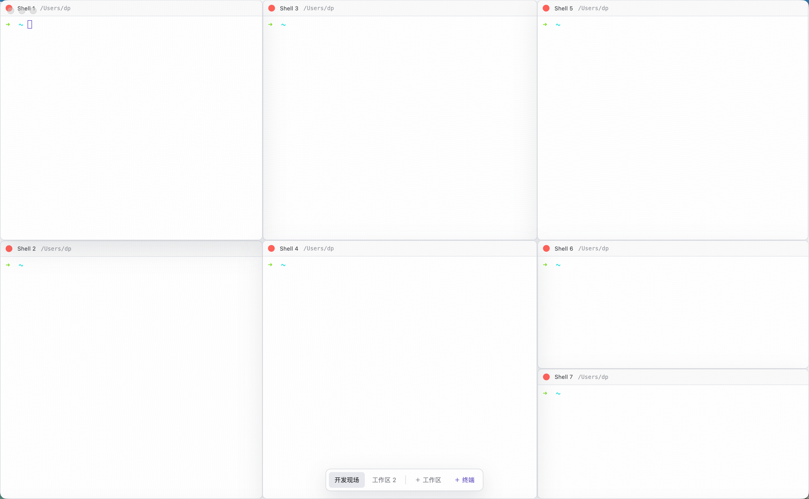

# Termdeck

一个能保存并恢复开发现场的桌面终端管理器。

[下载最新版 Termdeck](https://github.com/miaohongtu/termdeck/releases/latest)

目前提供 Apple Silicon（M1/M2/M3/M4）版本。应用尚未经过 Apple 签名和公证，首次打开时 macOS 可能显示安全提示。



## MVP

- 工作区自动持久化
- 每个终端保存标题、工作目录和恢复命令
- 重启应用后自动重建终端会话
- 终端网格和标签管理

> 电脑关机后进程本身不能继续存活。Termdeck 会恢复布局，并按配置重新启动 Shell/命令。

## 开发

```bash
npm install
npm run dev
```

## 打包

```bash
# 当前 Apple Silicon Mac：生成 DMG 和 ZIP
npm run dist

# Intel Mac
npm run dist:x64

# 同时生成两种架构
npm run dist:all
```

产物位于 `release/`。未配置 Apple Developer ID 时会生成未签名安装包，适合本机测试；公开分发需要额外配置签名与公证。
